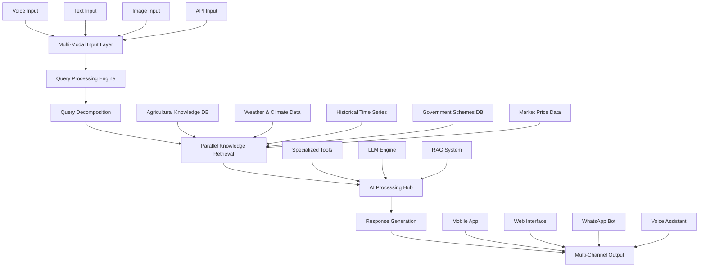

# 🌾 IndicAgri: Intelligent Agricultural Chatbot System for India

<!---->
<!---->

> ⚠️ **WARNING: This project is a work in progress!** We have just started development and many features may be incomplete or unstable.

An end-to-end multi-modal AI chatbot system specifically designed to provide comprehensive agricultural guidance to Indian farmers through advanced RAG (Retrieval-Augmented Generation) architecture and specialized agricultural knowledge integration.

## 🌟 Overview

IndicAgri is a comprehensive AI agricultural assistance system built specifically for the Indian agricultural ecosystem. The system combines cutting-edge language models, multi-modal processing, real-time data integration and specialized agricultural knowledge to provide farmers with actionable, region-specific, and scientifically accurate agricultural guidance.

### 🎯 Primary Objectives
- **Comprehensive Agricultural Guidance**: Cover all aspects of Indian farming from crop selection to market analysis
- **Multi-Modal Accessibility**: Support voice, text, and image inputs for diverse user needs
- **Regional Specificity**: Provide location and season-aware recommendations
- **Real-Time Intelligence**: Integrate live weather, market, and government scheme data
- **Scientific Accuracy**: Ensure all recommendations are backed by reliable sources with citations

## 🏗️ System Architecture

  

### 🔄 Core Processing Pipeline

1. **Input Standardization**: Multi-modal input processing and normalization
2. **Query Understanding**: Intent classification, entity extraction, and context analysis
3. **Query Decomposition**: Breaking complex queries into specialized sub-queries
4. **Parallel Knowledge Retrieval**: Simultaneous data fetching from multiple sources
5. **AI Reasoning**: LLM-powered analysis with agricultural tools integration
6. **Response Synthesis**: Comprehensive answer generation with source citations
7. **Multi-Format Output**: Delivery across multiple channels and formats

## ✨ Key Features

### 🧠 Advanced AI Capabilities
- **Retrieval-Augmented Generation**: Enhanced responses using curated agricultural knowledge
- **Multi-Modal Processing**: Text, voice, and image understanding
- **Context-Aware Reasoning**: Maintains conversation history and user profile

### 🌍 Indian Agriculture Specializations
- **Regional Adaptation**: State and district-specific recommendations
- **Seasonal Intelligence**: Kharif/Rabi/Zaid season awareness
- **Crop-Specific Guidance**: 100+ crop varieties with detailed cultivation practices
- **Government Integration**: Real-time scheme eligibility and subsidy information

### 📊 Real-Time Data Integration
- **Weather APIs**: IMD, AccuWeather integration for accurate forecasts
- **Government Schemes**: Automatic updates from agricultural ministry databases
- **Research Integration**: Latest findings from ICAR and agricultural universities

### 🛠️ Specialized Agricultural Tools
- **Crop Recommender**: AI-powered crop selection based on soil, climate, and market factors
- **Soil Analyzer**: Soil test interpretation and fertilizer recommendations
- **Irrigation Planner**: Water requirement calculation and scheduling
- **Weather Predictor**: Localized weather forecasting for farm planning
- **Market Tracker**: Price trend analysis and optimal selling time predictions

## 📊 Dataset Integration

### IndicAgri Dataset
This system leverages the **[IndicAgri Dataset](https://huggingface.co/datasets/ShuvBan/IndicAgri)** a comprehensive agricultural knowledge base we built from scratch through systematic web scraping of 15,000+ Indian agriculture resources.

**Dataset Statistics:**
- **Size**: 15,000+ structured entries
- **Coverage**: All major Indian crops, farming practices, and regional variations
- **Sources**: Government publications, research papers, extension materials

**Data Categories:**
- 🌱 **Crop Science**: Varieties, cultivation practices, breeding techniques
- 🌾 **Soil Management**: Soil types, fertility management, conservation
- 💧 **Water Resources**: Irrigation methods, water conservation, drainage
- 🐛 **Plant Protection**: Disease management, pest control, integrated approaches
- 🚜 **Agricultural Technology**: Precision farming, mechanization, digital tools
- 🌿 **Sustainable Farming**: Organic practices, climate-smart agriculture
- 💼 **Agricultural Economics**: Market analysis, government policies, insurance
- 🌡️ **Climate Adaptation**: Weather patterns, climate change impacts

### Database Generation System
The dataset creation process is managed through our comprehensive **[Database Generation System](./organized_database_creation/)** which includes:
- **Keyword-Based Search**: Systematic data collection using predefined agriculture queries
- **Autonomous Agent Search**: AI-driven adaptive data collection with specialized agents
- **Quality Assurance**: Multi-layer validation and relevance scoring
- **Continuous Updates**: Real-time integration of new agricultural research and policies

## 🎙️ Multi-Modal Capabilities

### Voice Processing
- **Speech-to-Text**: Support for 12 Indian languages
- **Text-to-Speech**: High-quality voice responses in regional languages
- **Noise Handling**: Background noise filtering for field conditions

### Text Processing
- **Multi-Language Support**: 12 Indian languages with auto-detection
- **Technical Terminology**: Extensive agricultural vocabulary recognition
- **Regional Dialects**: Support for regional variations in language

***

**Built with ❤️ for Indian Agriculture**

For more information [contact our team here](mailto:ahelipoddar2003@gmail.com)
