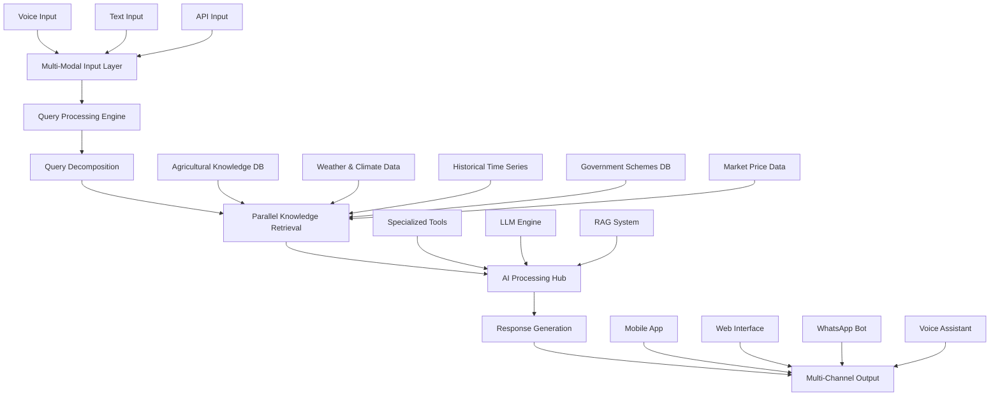

# 🌾 IndicAgri: Comprehensive Agricultural Intelligence Platform

[](https://python.org)
[](https://huggingface.co/datasets/ShuvBan/IndicAgri)
[](https://github.com/AI4Bharat)
[](https://opensource.org/license/bsd-3-clause-open-mpi)

## 📝 Abstract

**IndicAgri** is a sophisticated agricultural intelligence platform specifically designed for Indian farming communities, integrating cutting-edge AI technologies with comprehensive agricultural knowledge dissemination. The platform employs a multi-agent architecture powered by Ollama's gemma3:1b model, enabling real-time web search capabilities and contextual agricultural guidance through an intuitive text-based interface.

The system features **specialized agricultural agents** including crop specialists, disease experts, climate researchers, economics analysts, technology advisors, and policy analysts, each providing domain-specific insights with comprehensive source attribution. The platform's **advanced voice transcription infrastructure** is designed to support 10 major Indian languages (Hindi, Marathi, Bengali, Telugu, Tamil, Gujarati, Kannada, Malayalam, Punjabi, Odia) using AI4Bharat's Conformer models, NeMo toolkit, and IndicTrans2 translation pipeline, with foundational voice processing capabilities currently implemented.

**IndicAgri's Dataset Creation System** employs dual methodologies for comprehensive knowledge acquisition: **keyword-based systematic search** targeting specific agricultural domains, and **autonomous agentic search** using intelligent agents that adaptively generate queries. This approach has successfully compiled extensive agricultural datasets covering Indian farming practices, crop management, soil science, climate adaptation, and economic policies. The platform includes sophisticated **BM25 retrieval systems** for rapid similarity search (24GB indexed data) and **state-of-the-art embedding generation** using Qwen3-Embedding-8B models with FAISS indexing for semantic search capabilities.

The platform features **robust production-ready infrastructure** with automated installation scripts, virtual environment management, comprehensive error handling, and modular architecture supporting both detailed analytical responses and concise practical advice modes. Real-time citation generation with inline source attribution ensures information credibility. **IndicAgri** represents a significant advancement in accessible agricultural technology, providing a scalable foundation for bridging the digital divide for Indian farmers while maintaining scientific rigor through its advanced retrieval-augmented generation pipeline.

## 🚀 Quick Start Installation

### 📋 Prerequisites

- **OS**: Ubuntu 20.04+ / Linux with Docker support
- **RAM**: 8GB+ (minimum for local LLM)
- **Storage**: 10GB free space
- **Network**: Stable internet connection


### ⚡ Standard Installation

```bash
# For Ubuntu / Debian
sudo apt update && sudo apt install -y python3 python3-pip python3-venv git curl

# For Fedora
sudo dnf install -y python3 python3-pip python3-venv git curl

# For CentOS / RHEL (with EPEL enabled)
sudo yum install -y python3 python3-pip python3-venv git curl

# For Arch Linux
sudo pacman -Syu --noconfirm python python-pip git curl

# If you are using any other GNU/Linux distribution, please update the package manager command accordingly.
```
```bash
# Clone repository
git clone https://github.com/Shuvam-Banerji-Seal/Answering_Agriculture.git
cd Answering_Agriculture

# Run automated installation
./install_agri_bot.sh

# Start the agriculture bot
./start_agri_bot.sh
```

### 🔧 Alternative Installation (If HTTP 404 errors occur)
```bash
# For Ubuntu / Debian
sudo apt update && sudo apt install -y python3 python3-pip python3-venv git curl

# For Fedora
sudo dnf install -y python3 python3-pip python3-venv git curl

# For CentOS / RHEL (with EPEL enabled)
sudo yum install -y python3 python3-pip python3-venv git curl

# For Arch Linux
sudo pacman -Syu --noconfirm python python-pip git curl

# If you are using any other GNU/Linux distribution, please update the package manager command accordingly.
```
```bash
# Clone repository
git clone https://github.com/Shuvam-Banerji-Seal/Answering_Agriculture.git
cd Answering_Agriculture

# Pre-download basic model to avoid installation issues
ollama pull gemma3:1b 

# Run installation and start
./install_agri_bot.sh
./start_agri_bot.sh
```

### 🎯 Access the System

**Web Interface**: [http://127.0.0.1:5000/](http://127.0.0.1:5000/) *(Ctrl+click to open)*

***

## ⚠️ Important Setup Notes

### 🔑 Critical Step Before Starting

**Run this command before starting the bot in case `Ollama` doesn't get downloaded**

```bash
ollama pull gemma3:1b
```

### 🌐 Enhanced Language Support

For **better multilingual support** and improved performance:

```bash
ollama run gemma3:27b  # Instead of gemma3:1b
```

**Note**: Requires additional 30GB+ RAM for optimal performance.

***

## 🔧 Troubleshooting

### **Port 5000 Already in Use**
```bash
docker ps
docker stop agri-bot-searcher
./start_agri_bot.sh
```

### **Model Not Found Error**
```bash
ollama list                # Check installed models
ollama pull gemma3:1b     # Download if missing
```

### **Manual Startup (If Automated Script Fails)**
```bash
source agri_bot_env/bin/activate
cd agri_bot_searcher
python src/web_ui.py
```

### **Docker Setup Issues**

For detailed Docker installation and troubleshooting:

- **Linux Mint**: [🎥 Docker Setup Tutorial](https://youtu.be/h0L_zUA_kP4?si=8xV7bQdUsVoTUB-W)
- **Ubuntu**: [🎥 Docker Setup Tutorial](https://youtu.be/cqbh-RneBlk?si=EkFqE4xU3jGbOdXq)


## 🌟 Overview

IndicAgri is a comprehensive AI agricultural assistance system built specifically for the Indian agricultural ecosystem. The system combines cutting-edge language models, multi-modal processing, real-time data integration and specialized agricultural knowledge to provide farmers with actionable, region-specific, and scientifically accurate agricultural guidance.
- **Real-Time Intelligence**: Integrate live weather, market, and government scheme data
- **Scientific Accuracy**: Ensure all recommendations are backed by reliable sources with citations
### 🎯 Primary Objectives
- **Comprehensive Agricultural Guidance**: Cover all aspects of Indian farming from crop selection to market analysis  
- **Multi-Agent Intelligence**: Deploy specialized agricultural experts for domain-specific insights
- **Real-time Information**: Live web search integration for current agricultural information
- **Scientific Accuracy**: Citation-backed responses with comprehensive source verification
- **Scalable Architecture**: Extensible framework with voice transcription infrastructure for future multilingual support
- **Production Ready**: Robust installation and deployment system for reliable agricultural assistance

## 🏗️ System Architecture


  


### 🔄 Core Processing Pipeline

1. **Input Standardization**: Multi-modal input processing and normalization
2. **Query Understanding**: Intent classification, entity extraction, and context analysis
3. **Query Decomposition**: Breaking complex queries into specialized sub-queries
4. **Parallel Knowledge Retrieval**: Simultaneous data fetching from multiple sources
5. **AI Reasoning**: LLM-powered analysis with agricultural tools integration
6. **Response Synthesis**: Comprehensive answer generation with source citations
7. **Multi-Format Output**: Delivery across multiple channels and formats

## ✨ Key Features

### 🧠 Advanced AI Capabilities
- **Retrieval-Augmented Generation**: Enhanced responses using curated agricultural knowledge
- **Multi-Modal Processing**: Text, voice, and image understanding
- **Context-Aware Reasoning**: Maintains conversation history and user profile

### 🌍 Indian Agriculture Specializations
- **Regional Adaptation**: State and district-specific recommendations
- **Seasonal Intelligence**: Kharif/Rabi/Zaid season awareness
- **Crop-Specific Guidance**: 100+ crop varieties with detailed cultivation practices
- **Government Integration**: Real-time scheme eligibility and subsidy information

### 📊 Real-Time Data Integration
- **Weather APIs**: IMD, AccuWeather integration for accurate forecasts
- **Government Schemes**: Automatic updates from agricultural ministry databases
- **Research Integration**: Latest findings from ICAR and agricultural universities

### 🛠️ Specialized Agricultural Tools
- **Crop Recommender**: AI-powered crop selection based on soil, climate, and market factors
- **Soil Analyzer**: Soil test interpretation and fertilizer recommendations
- **Irrigation Planner**: Water requirement calculation and scheduling
- **Weather Predictor**: Localized weather forecasting for farm planning
- **Market Tracker**: Price trend analysis and optimal selling time predictions

## 📊 Dataset Integration

### IndicAgri Dataset
This system leverages the **[IndicAgri Dataset](https://huggingface.co/datasets/ShuvBan/IndicAgri)** a comprehensive agricultural knowledge base we built from scratch through systematic web scraping of 15,000+ Indian agriculture resources.

**Dataset Statistics:**
- **Size**: 15,000+ structured entries
- **Coverage**: All major Indian crops, farming practices, and regional variations
- **Sources**: Government publications, research papers, extension materials

**Data Categories:**
- 🌱 **Crop Science**: Varieties, cultivation practices, breeding techniques
- 🌾 **Soil Management**: Soil types, fertility management, conservation
- 💧 **Water Resources**: Irrigation methods, water conservation, drainage
- 🐛 **Plant Protection**: Disease management, pest control, integrated approaches
- 🚜 **Agricultural Technology**: Precision farming, mechanization, digital tools
- 🌿 **Sustainable Farming**: Organic practices, climate-smart agriculture
- 💼 **Agricultural Economics**: Market analysis, government policies, insurance
- 🌡️ **Climate Adaptation**: Weather patterns, climate change impacts

### Database Generation System
The dataset creation process is managed through our comprehensive **[Database Generation System](./organized_database_creation/)** which includes:
- **Keyword-Based Search**: Systematic data collection using predefined agriculture queries
- **Autonomous Agent Search**: AI-driven adaptive data collection with specialized agents
- **Quality Assurance**: Multi-layer validation and relevance scoring
- **Continuous Updates**: Real-time integration of new agricultural research and policies


## 🎙️ Multi-Modal Capabilities

### Voice Processing
- **Speech-to-Text**: Support for 12 Indian languages
- **Text-to-Speech**: High-quality voice responses in regional languages
- **Noise Handling**: Background noise filtering for field conditions

### Text Processing
- **Multi-Language Support**: 12 Indian languages with auto-detection
- **Technical Terminology**: Extensive agricultural vocabulary recognition
- **Regional Dialects**: Support for regional variations in language


## 🎯 Test Queries

### Try these sample queries to test the system:

- "What crops are best for northeastern India?"
- "Rice crop yellow leaves treatment"
- "Maharashtra wheat market prices"
- "Government agriculture schemes 2025"
- "Monsoon season farming recommendations"

***

**Built with ❤️ for Indian Agriculture**

For more information [contact our team here](mailto:ahelipoddar2003@gmail.com)
