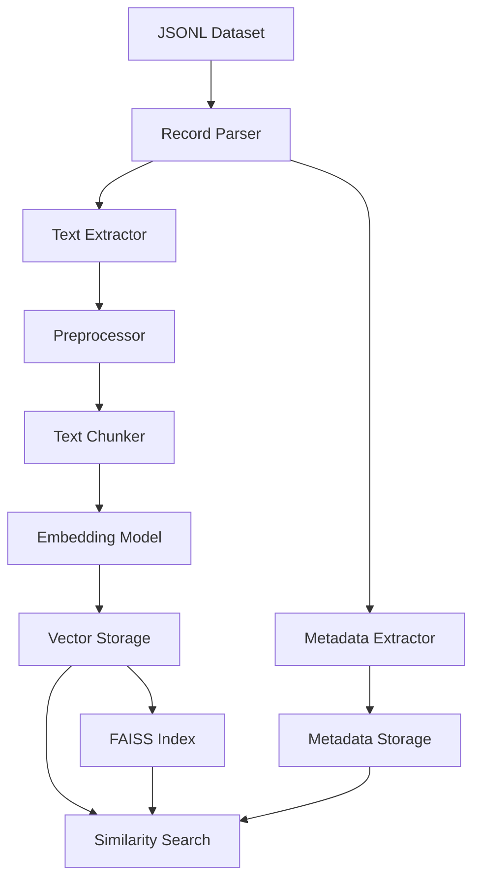

# Architecture Documentation

## System Overview

The Agriculture Embedding Generator is designed as a modular, scalable system for processing agricultural text data and generating high-quality embeddings suitable for semantic search and retrieval applications.

## Core Components

### 1. Text Processing Pipeline

```
Raw Text → Preprocessing → Chunking → Embedding Generation → Indexing
```

#### Text Preprocessing
- **Input**: Raw text from JSONL records
- **Processing**: Optional custom preprocessing functions
- **Output**: Cleaned, normalized text ready for chunking

#### Intelligent Chunking
- **Strategy**: Overlapping token-based chunking
- **Benefits**: Preserves context across chunk boundaries
- **Configuration**: Adjustable chunk size and overlap

#### Embedding Generation
- **Model**: Qwen3-Embedding-8B (4096-dimensional vectors)
- **Method**: Mean pooling of last hidden states
- **Optimization**: GPU acceleration when available

#### Vector Indexing
- **Library**: FAISS (Facebook AI Similarity Search)
- **Index Types**: Flat (exact) and IVF (approximate)
- **Similarity**: Cosine similarity with L2 normalization

### 2. Data Flow Architecture



### 3. Storage Architecture

#### File Structure
```
embeddings_output/
├── embeddings.npy          # Dense vectors (NumPy format)
├── faiss_index.bin         # FAISS index for fast search
├── metadata.json           # Human-readable metadata
├── metadata.pkl            # Binary metadata (faster loading)
├── config.json             # Generation configuration
└── summary_stats.json      # Dataset statistics
```

#### Data Formats

**Embeddings**: NumPy arrays (float32) for memory efficiency
**Metadata**: JSON and Pickle formats for flexibility
**Index**: Binary FAISS format for optimal search performance

### 4. Model Architecture

#### Qwen3-Embedding-8B Integration

```python
# Model Pipeline
Input Text → Tokenization → Model Forward Pass → Hidden States → Mean Pooling → L2 Normalization
```

**Key Features:**
- 8B parameter transformer model
- 4096-dimensional output vectors
- Optimized for semantic similarity tasks
- Support for long context (up to chunk_size tokens)

#### Memory Management

```python
# GPU Memory Optimization
- Model loading: ~8GB GPU memory
- Batch processing: Configurable batch sizes
- Gradient computation: Disabled (eval mode)
- Memory cleanup: Automatic garbage collection
```

### 5. Scalability Design

#### Horizontal Scaling
- **Batch Processing**: Process large datasets in chunks
- **Distributed Processing**: Multiple workers for parallel processing
- **Memory Management**: Configurable memory usage limits

#### Vertical Scaling
- **GPU Acceleration**: CUDA support for faster processing
- **Model Optimization**: Efficient model loading and inference
- **Index Optimization**: FAISS optimizations for large-scale search

### 6. Agricultural Domain Specialization

#### Metadata Schema
```python
@dataclass
class ChunkMetadata:
    # Document metadata
    record_id: str
    title: str
    author: str
    link: str
    source_domain: str
    
    # Agricultural metadata
    crop_types: List[str]        # Rice, wheat, etc.
    farming_methods: List[str]   # Organic, sustainable, etc.
    soil_types: List[str]        # Alluvial, black soil, etc.
    climate_info: List[str]      # Tropical, arid, etc.
    fertilizers: List[str]       # Nitrogen, compost, etc.
    indian_regions: List[str]    # Punjab, Kerala, etc.
    
    # Content metadata
    chunk_text: str
    content_length: int
    relevance_score: float
```

#### Domain-Specific Features
- **Agricultural Taxonomy**: Structured categorization of agricultural concepts
- **Regional Context**: Indian agriculture focus with regional metadata
- **Multi-modal Support**: Text, abstract, and metadata integration
- **Quality Scoring**: Relevance scoring for content filtering

### 7. Performance Characteristics

#### Processing Speed
- **CPU Mode**: ~10-20 records/minute
- **GPU Mode**: ~50-100 records/minute
- **Batch Size Impact**: Linear scaling with batch size

#### Memory Usage
- **Model**: ~8GB GPU memory (Qwen3-Embedding-8B)
- **Processing**: ~2-4GB RAM per 1000 records
- **Storage**: ~16KB per embedding (4096 * 4 bytes)

#### Search Performance
- **Index Build**: O(n log n) for n embeddings
- **Search Time**: O(log n) for IVF, O(n) for flat
- **Typical Query**: <1ms for 1M embeddings (GPU)

### 8. Quality Assurance

#### Validation Pipeline
```python
# Automated validation checks
1. File integrity validation
2. Embedding dimension consistency
3. Metadata completeness
4. Index functionality testing
5. Search accuracy verification
```

#### Error Handling
- **Graceful Degradation**: Continue processing on individual record failures
- **Logging**: Comprehensive logging for debugging
- **Recovery**: Automatic retry mechanisms for transient failures
- **Validation**: Pre and post-processing validation checks

### 9. Extension Points

#### Custom Preprocessing
```python
def custom_preprocess(text: str) -> str:
    # Custom text cleaning and normalization
    return processed_text

system.preprocess_function = custom_preprocess
```

#### Custom Filtering
```python
def domain_filter(record: Dict) -> bool:
    # Custom record filtering logic
    return record.get('source_domain') in allowed_domains

system.process_dataset(file, filter_function=domain_filter)
```

#### Custom Models
```python
# Support for different embedding models
system = AgricultureEmbeddingSystem(
    model_name="custom/agriculture-bert",
    chunk_size=512,
    device="cuda"
)
```

### 10. Security Considerations

#### Data Privacy
- **Local Processing**: All processing happens locally
- **No External Calls**: No data sent to external services
- **Secure Storage**: Local file system storage only

#### Model Security
- **Trusted Sources**: Models from verified HuggingFace repositories
- **Version Pinning**: Specific model versions for reproducibility
- **Checksum Validation**: Model integrity verification

### 11. Monitoring and Observability

#### Logging
```python
# Structured logging
- Processing progress with tqdm
- Error logging with stack traces
- Performance metrics logging
- Resource usage monitoring
```

#### Metrics
- **Processing Rate**: Records/minute, chunks/minute
- **Quality Metrics**: Average chunk length, embedding distribution
- **Resource Metrics**: Memory usage, GPU utilization
- **Error Rates**: Failed records, processing errors

### 12. Future Architecture Considerations

#### Planned Enhancements
- **Multi-language Support**: Support for regional Indian languages
- **Incremental Updates**: Add new data without full reprocessing
- **Distributed Processing**: Multi-node processing support
- **Advanced Indexing**: Hierarchical and product quantization

#### Scalability Roadmap
- **Cloud Integration**: Support for cloud storage and processing
- **Streaming Processing**: Real-time embedding generation
- **Model Updates**: Hot-swapping of embedding models
- **API Service**: REST API for embedding generation and search