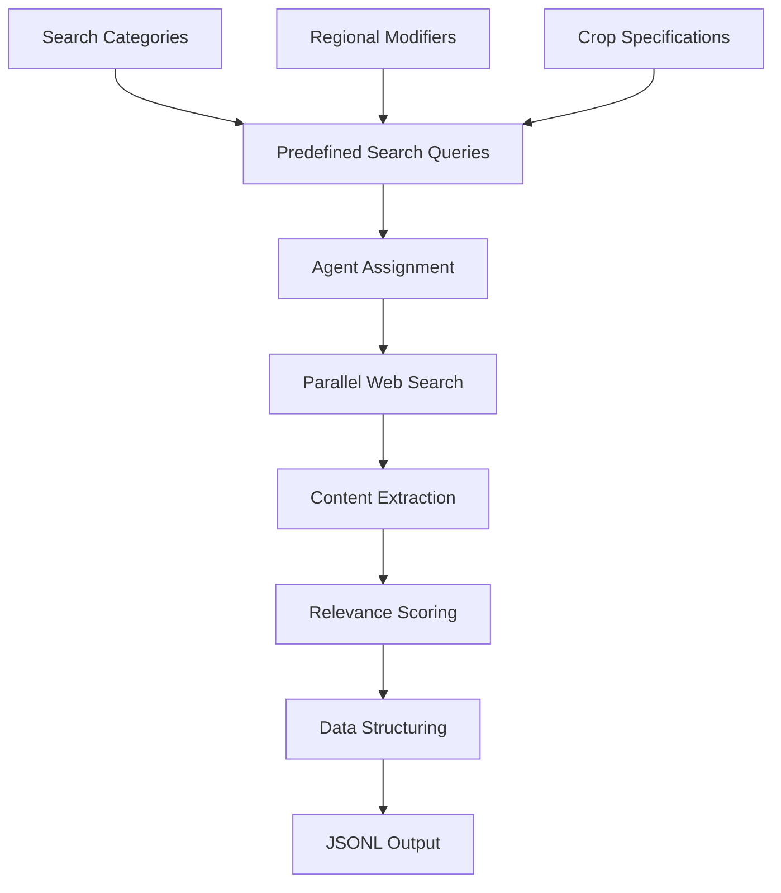
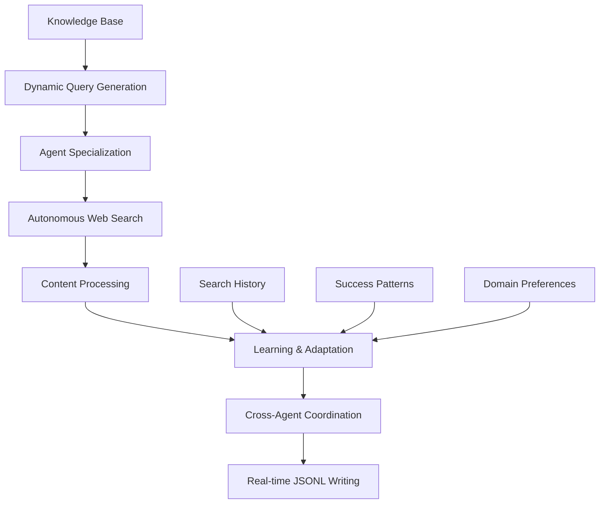

# Indian Agriculture Database Creation System

A comprehensive multi-agent system for creating structured datasets on Indian agriculture through intelligent web scraping and data curation. This repository contains two main approaches for collecting agriculture data from the internet.

## 🌾 Overview

This system was designed to create comprehensive datasets for Retrieval-Augmented Generation (RAG) pipelines focused on Indian agriculture. It employs two distinct but complementary approaches to gather data from across the internet:

1. **Keyword-Based Search Approach** - Systematic searches using predefined agriculture-related queries
2. **Autonomous Agentic Search Approach** - Intelligent agents that autonomously generate and execute searches

## 📊 System Architecture

```
Internet Sources (Global Web)
         ↓
   Search Engines (DuckDuckGo)
         ↓
┌─────────────────┬─────────────────┐
│  Keyword-Based  │  Autonomous     │
│  Search System  │  Agent System   │
└─────────────────┴─────────────────┘
         ↓
   Content Processing
         ↓
   Data Structuring
         ↓
   JSONL Dataset Output
```

## 🎯 Two Main Approaches

### 1. Keyword-Based Search Approach

**Location**: `keyword_based_search/`

A systematic approach using predefined search queries covering all aspects of Indian agriculture.

**Key Features**:
- 60+ predefined search queries
- 4-20 parallel agents processing queries
- Specialized agent roles (crop production, sustainable farming, policy, technology)
- Fixed search patterns with regional and crop-specific modifications

**Search Categories**:
- Crops: Rice, wheat, cotton, sugarcane, pulses, millets, spices, fruits, vegetables
- Regions: All 28 Indian states and agricultural zones
- Methods: Organic farming, precision agriculture, irrigation, soil management
- Economics: Agricultural policies, subsidies, market dynamics

### 2. Autonomous Agentic Search Approach

**Location**: `autonomous_agent_search/`

An intelligent system where agents autonomously generate search queries and adapt their strategies.

**Key Features**:
- 12+ specialized autonomous agents
- Unlimited dynamic query generation
- Self-learning and adaptive search strategies
- Cross-agent coordination and deduplication
- Real-time processing and immediate data writing

**Agent Specializations**:
1. Crop Science & Plant Breeding
2. Soil Science & Fertility Management
3. Water Resources & Irrigation
4. Plant Protection & Pest Management
5. Agricultural Technology & Precision Farming
6. Sustainable & Organic Farming
7. Agricultural Economics & Policy
8. Climate Change & Adaptation
9. Horticulture & Plantation Crops
10. Livestock & Animal Husbandry
11. Food Processing & Post-Harvest
12. Rural Development & Extension

## 📁 Repository Structure

```
organized_database_creation/
├── README.md                           # This file
├── docs/                              # Documentation
│   ├── keyword_approach_diagram.md    # Keyword approach workflow
│   ├── autonomous_approach_diagram.md # Autonomous approach workflow
│   ├── data_format_specification.md   # Output data format details
│   └── comparison_analysis.md         # Approach comparison
├── keyword_based_search/              # Keyword-based approach
│   ├── README.md                      # Keyword approach documentation
│   ├── src/                          # Source code
│   │   ├── agriculture_data_curator.py
│   │   ├── agriculture_curator_fixed.py
│   │   └── enhanced_web_search.py
│   ├── config/                       # Configuration files
│   │   ├── config.yaml
│   │   └── search_queries.py
│   ├── tests/                        # Test files
│   │   ├── test_installation.py
│   │   ├── test_fixed_curator.py
│   │   └── examples.py
│   └── requirements.txt              # Dependencies
├── autonomous_agent_search/           # Autonomous approach
│   ├── README.md                     # Autonomous approach documentation
│   ├── src/                         # Source code
│   │   ├── autonomous_agriculture_curator.py
│   │   ├── autonomous_search_agent.py
│   │   └── knowledge_base.py
│   ├── config/                      # Configuration files
│   │   ├── autonomous_config.yaml
│   │   └── agent_specializations.py
│   ├── tests/                       # Test files
│   │   ├── test_autonomous.py
│   │   └── demo_autonomous.py
│   └── requirements.txt             # Dependencies
├── shared/                          # Shared utilities
│   ├── pdf_processor.py            # PDF processing utilities
│   ├── web_scraper.py              # Web scraping utilities
│   ├── data_validator.py           # Data validation
│   └── jsonl_writer.py             # JSONL output handling
├── sample_outputs/                  # Sample dataset outputs
│   ├── keyword_sample.jsonl        # Sample from keyword approach
│   ├── autonomous_sample.jsonl     # Sample from autonomous approach
│   └── combined_sample.jsonl       # Combined dataset sample
└── setup/                          # Setup and installation
    ├── setup.py                    # Automated setup script
    ├── install_dependencies.sh     # Dependency installation
    └── system_requirements.md      # System requirements
```

## 🔄 Data Flow Diagrams

### Keyword-Based Search Flow



### Autonomous Agent Search Flow



## 📋 Data Format Specification

Each entry in the output JSONL files contains:

```json
{
  "title": "Content title",
  "author": "Author if available",
  "link": "Source URL",
  "text_extracted": "Full extracted content",
  "abstract": "Brief summary",
  "genre": "survey|dataset|pdf|book|report|article",
  "tags": ["relevant", "agriculture", "tags"],
  "indian_regions": ["Punjab", "Maharashtra"],
  "crop_types": ["rice", "wheat"],
  "farming_methods": ["organic", "irrigation"],
  "soil_types": ["black", "alluvial"],
  "climate_info": ["tropical", "monsoon"],
  "fertilizers": ["organic", "NPK"],
  "data_type": "statistical|qualitative|mixed",
  "publication_year": 2023,
  "source_domain": "icar.org.in",
  "extraction_timestamp": "2025-08-09T10:30:45",
  "relevance_score": 0.85,
  "content_length": 3245,
  "content_hash": "unique_hash",
  "url_hash": "unique_url_hash",
  "is_pdf": false,
  "pdf_path": null
}
```

## 🚀 Quick Start

### Prerequisites

1. **Python 3.9+**
2. **Required packages** (see requirements.txt in each approach)
3. **System dependencies** for PDF processing and OCR

### Installation

```bash
# Clone or download the repository
cd organized_database_creation

# Install dependencies for both approaches
pip install -r keyword_based_search/requirements.txt
pip install -r autonomous_agent_search/requirements.txt

# Run setup script
python setup/setup.py
```

### Running the Systems

**Keyword-Based Approach:**
```bash
cd keyword_based_search
python src/agriculture_data_curator.py
```

**Autonomous Agent Approach:**
```bash
cd autonomous_agent_search
python src/autonomous_agriculture_curator.py
```

## 📊 Expected Outputs

### Keyword-Based Approach
- **Data Volume**: 500-2,000 structured entries
- **Coverage**: Systematic coverage of predefined categories
- **Quality**: High relevance due to targeted searches
- **Processing Time**: 2-6 hours depending on configuration

### Autonomous Agent Approach
- **Data Volume**: 5,000-15,000+ structured entries
- **Coverage**: Comprehensive and adaptive coverage
- **Quality**: High diversity with intelligent filtering
- **Processing Time**: 4-12 hours depending on agent count

## 🔍 Approach Comparison

| Aspect | Keyword-Based | Autonomous Agent |
|--------|---------------|------------------|
| **Search Strategy** | Predefined queries | Dynamic generation |
| **Scalability** | Limited by query set | Unlimited expansion |
| **Coverage** | Systematic | Comprehensive |
| **Adaptability** | Fixed patterns | Self-learning |
| **Resource Usage** | Moderate | Higher |
| **Data Volume** | 500-2K entries | 5K-15K+ entries |
| **Setup Complexity** | Simple | Moderate |
| **Customization** | Query modification | Agent specialization |

## 🎯 Use Cases

### When to Use Keyword-Based Approach
- **Targeted data collection** for specific agriculture domains
- **Limited computational resources**
- **Quick prototyping** and testing
- **Specific research questions** with known parameters

### When to Use Autonomous Agent Approach
- **Comprehensive dataset creation** for RAG systems
- **Exploratory data collection** across all agriculture domains
- **Large-scale data requirements**
- **Continuous data collection** with adaptive strategies

## 🔧 Customization

### Keyword-Based Customization
- Modify `config/search_queries.py` to add new search patterns
- Adjust `config/config.yaml` for processing parameters
- Customize agent specializations in source code

### Autonomous Agent Customization
- Edit `config/autonomous_config.yaml` for agent behavior
- Modify knowledge base in `src/knowledge_base.py`
- Add new agent specializations in configuration

## 📈 Performance Metrics

### Data Quality Metrics
- **Relevance Score**: 0.0-1.0 based on agriculture content
- **Content Length**: Minimum thresholds for meaningful content
- **Source Diversity**: Coverage across government, academic, and research sources
- **Temporal Coverage**: Mix of historical and recent publications

### System Performance
- **Processing Speed**: Entries per hour
- **Success Rate**: Successful extractions vs attempts
- **Duplicate Rate**: Percentage of duplicate content detected
- **Error Rate**: Failed processing attempts

## 🛠️ Technical Dependencies

### Core Dependencies
- **requests**: HTTP requests and web scraping
- **duckduckgo-search**: Search engine integration
- **beautifulsoup4**: HTML parsing and content extraction
- **lxml**: XML/HTML processing

### PDF Processing
- **pypdf2**: PDF text extraction
- **pymupdf**: Advanced PDF processing
- **pytesseract**: OCR for scanned documents
- **pillow**: Image processing

### Data Processing
- **pyyaml**: Configuration file parsing
- **python-magic**: File type detection
- **hashlib**: Content deduplication

## 🔒 Data Privacy and Ethics

### Ethical Considerations
- **Robots.txt Compliance**: Respects website crawling policies
- **Rate Limiting**: Prevents server overload
- **Source Attribution**: Maintains original source links
- **Content Licensing**: Respects copyright and fair use

### Data Quality Assurance
- **Relevance Filtering**: Agriculture-specific content validation
- **Duplicate Detection**: URL and content-based deduplication
- **Source Verification**: Priority scoring for trusted domains
- **Content Validation**: Length and quality thresholds

## 🤝 Contributing

### Adding New Features
1. **New Search Strategies**: Implement in respective approach directories
2. **Enhanced Processing**: Add to shared utilities
3. **Output Formats**: Extend data format specifications
4. **Quality Improvements**: Enhance filtering and validation

### Testing
- Run test suites in each approach directory
- Validate output format compliance
- Test with different configuration parameters
- Monitor system performance and resource usage

## 📄 License

This project is designed for research and educational purposes. Please respect website terms of service and copyright when using the scraped data.

## 🙏 Acknowledgments

- **Heavy Ollama Project**: Inspiration for multi-agent architecture
- **Indian Agricultural Research Community**: Source of valuable data
- **Open Source Libraries**: Essential tools for web scraping and data processing

---

**Note**: This system is designed for research purposes. Always ensure compliance with website terms of service and respect rate limiting when scraping data.