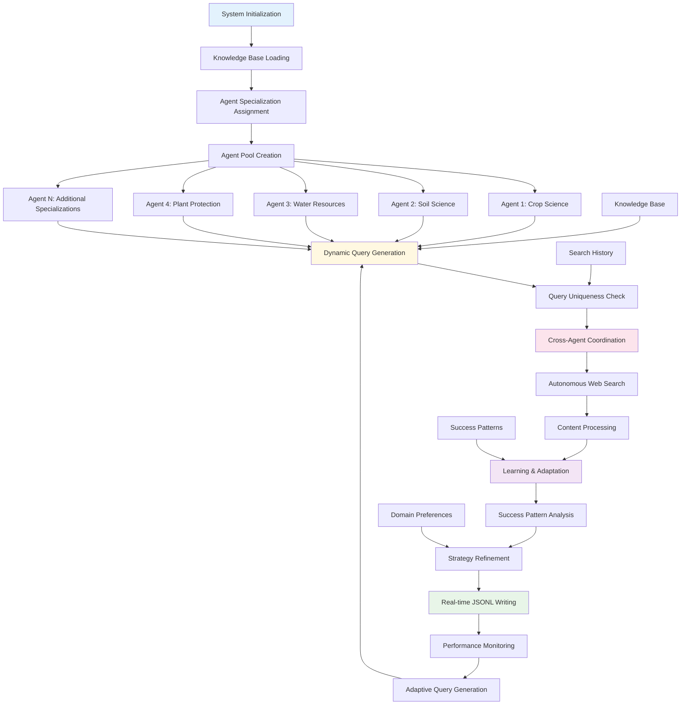
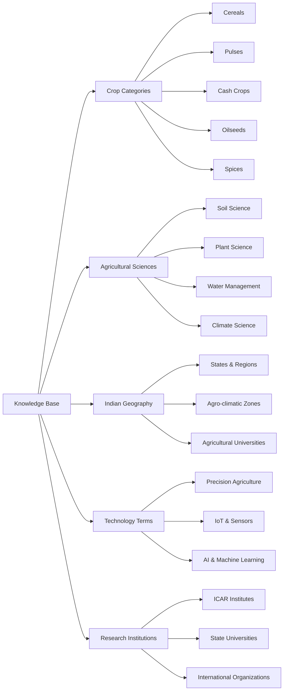
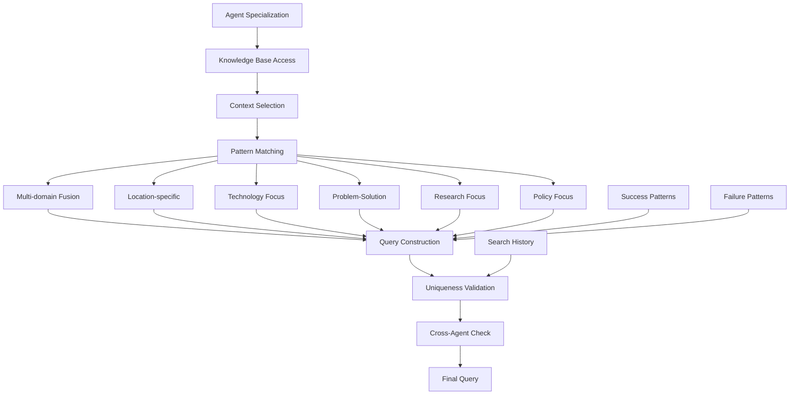
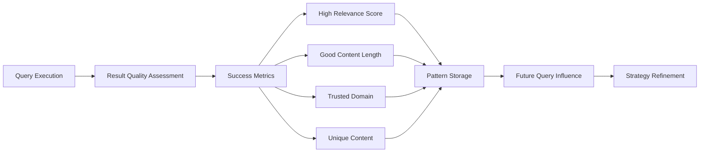
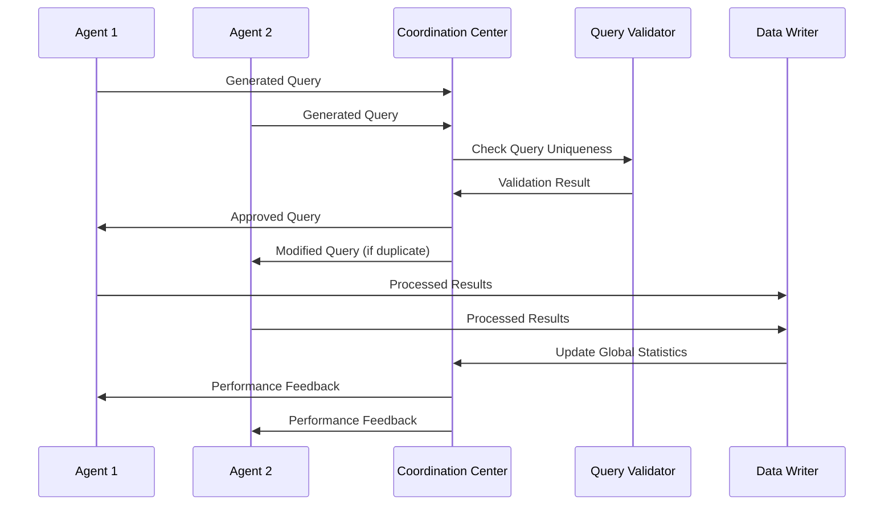
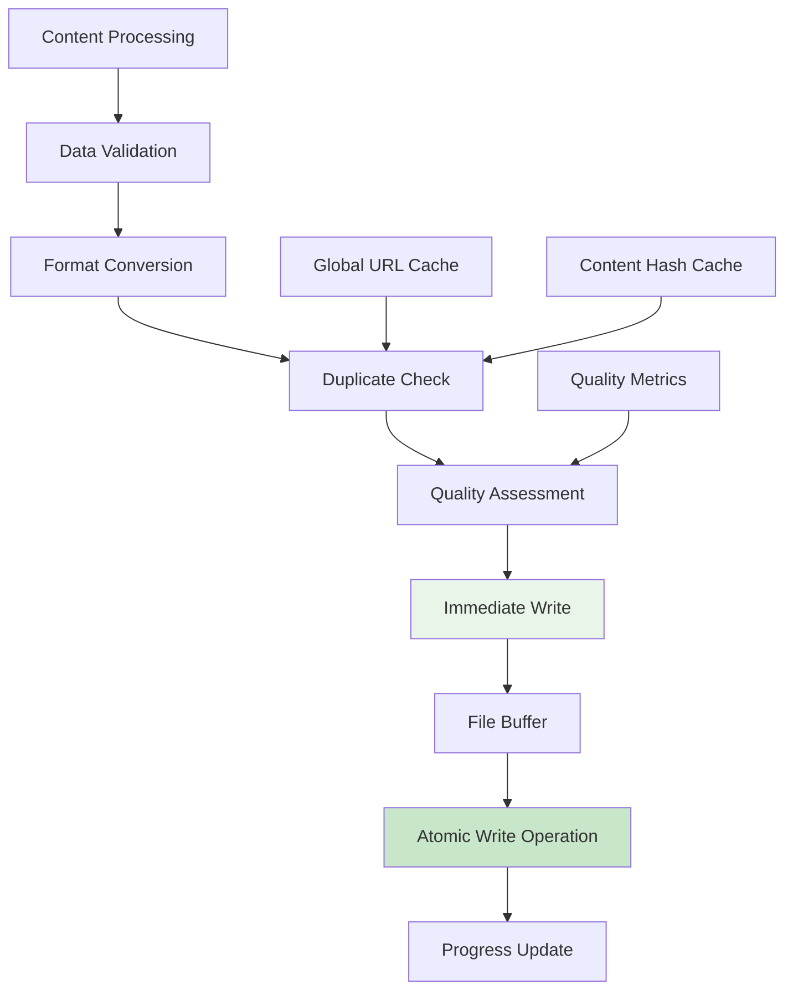
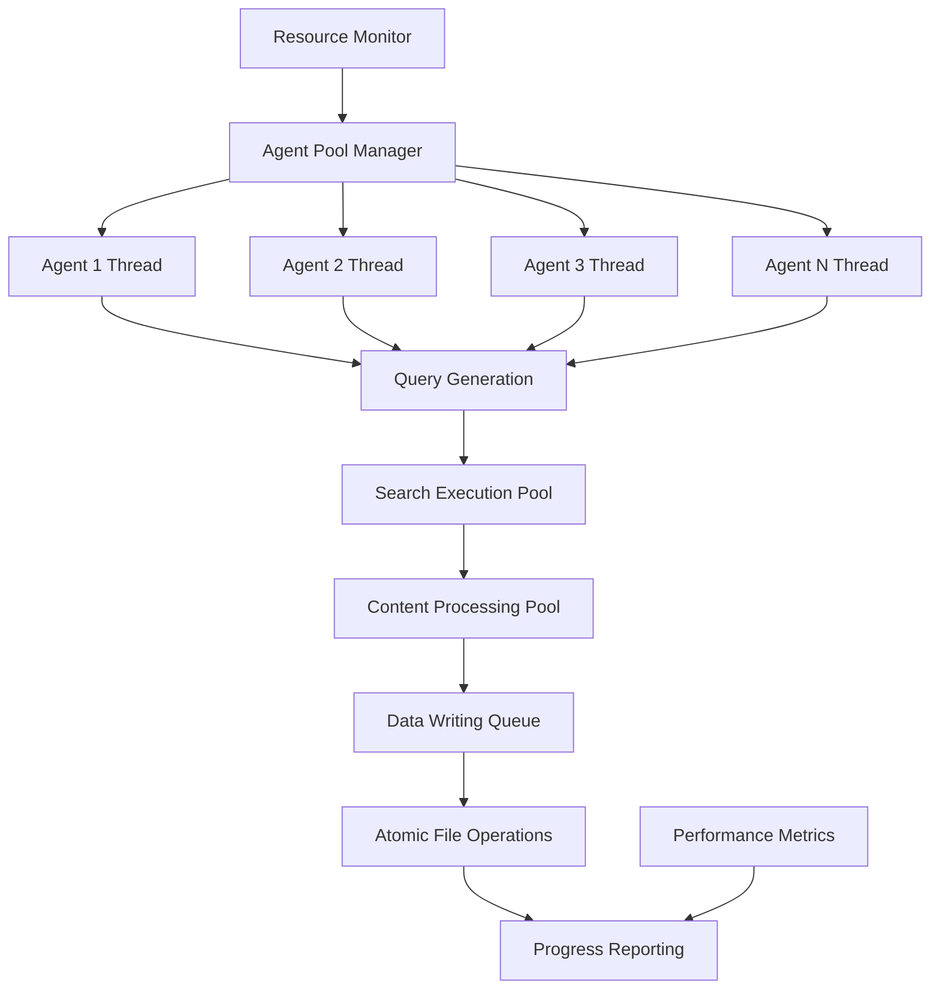
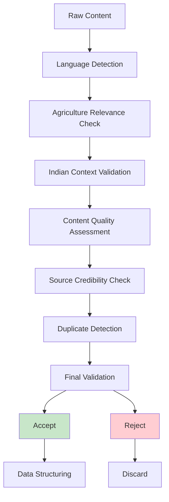

# Autonomous Agent Search Approach - Detailed Workflow

## 🤖 Overview

The autonomous agent search approach employs intelligent agents that can dynamically generate search queries, learn from their experiences, and adapt their strategies. This approach provides comprehensive coverage through self-directed exploration of the agriculture domain.

## 🔄 Detailed Workflow Diagram



## 🧠 Agent Intelligence Architecture

### 1. Knowledge Base Structure



### 2. Agent Specialization Matrix

| Agent ID | Specialization | Knowledge Focus | Query Patterns | Expected Discoveries |
|----------|----------------|-----------------|----------------|---------------------|
| 1 | Crop Science & Plant Breeding | Genetics, varieties, breeding | "{crop} breeding research India" | New varieties, genetic studies |
| 2 | Soil Science & Fertility | Soil health, nutrients, organic matter | "soil {property} {crop} {region}" | Soil management practices |
| 3 | Water Resources & Irrigation | Water management, conservation | "irrigation {technology} {crop}" | Water-saving techniques |
| 4 | Plant Protection & Pest Management | IPM, biological control, diseases | "pest management {crop} {method}" | Sustainable pest control |
| 5 | Agricultural Technology | IoT, sensors, precision farming | "{technology} agriculture {application}" | Tech innovations |
| 6 | Sustainable & Organic Farming | Organic practices, sustainability | "organic {crop} {practice} India" | Sustainable methods |
| 7 | Agricultural Economics & Policy | Economics, policy, subsidies | "{policy} agriculture {state}" | Economic analysis |
| 8 | Climate Change & Adaptation | Climate resilience, adaptation | "climate adaptation {crop}" | Climate solutions |
| 9 | Horticulture & Plantation | Fruits, vegetables, plantation crops | "{fruit} cultivation {region}" | Horticultural practices |
| 10 | Livestock & Animal Husbandry | Animal nutrition, dairy, poultry | "livestock {aspect} India" | Animal agriculture |
| 11 | Food Processing & Post-Harvest | Storage, processing, value addition | "post harvest {crop} {technology}" | Processing innovations |
| 12 | Rural Development & Extension | Training, capacity building | "extension {service} farmers" | Development programs |

### 3. Dynamic Query Generation System



### 4. Query Generation Strategies

**Strategy 1: Multi-domain Fusion**
```python
def generate_fusion_query(agent):
    crop = random.choice(agent.knowledge_areas['crops'])
    science = random.choice(agent.knowledge_areas['sciences'])
    region = random.choice(agent.knowledge_areas['regions'])
    technology = random.choice(agent.knowledge_areas['technology'])
    
    return f"{crop} {science} {technology} {region} research"
```

**Strategy 2: Problem-Solution Pattern**
```python
def generate_problem_solution_query(agent):
    crop = random.choice(agent.knowledge_areas['crops'])
    problem = random.choice(['drought', 'pest', 'disease', 'yield'])
    solution = random.choice(['management', 'control', 'resistance'])
    
    return f"{crop} {problem} {solution} India farmers"
```

**Strategy 3: Temporal Analysis**
```python
def generate_temporal_query(agent):
    crop = random.choice(agent.knowledge_areas['crops'])
    time_aspect = random.choice(['trends', 'forecast', 'historical'])
    metric = random.choice(['production', 'yield', 'area'])
    
    return f"{crop} {metric} {time_aspect} India statistics"
```

## 🔄 Learning and Adaptation Mechanism

### 1. Success Pattern Recognition



### 2. Adaptive Query Refinement

**Learning Algorithm**:
```python
class AdaptiveLearning:
    def __init__(self):
        self.success_patterns = []
        self.failure_patterns = []
        self.domain_preferences = {}
        self.keyword_effectiveness = {}
    
    def record_success(self, query, results):
        pattern = self.extract_pattern(query)
        self.success_patterns.append({
            'pattern': pattern,
            'relevance_score': results.avg_relevance,
            'content_quality': results.avg_content_length,
            'domain_diversity': len(results.unique_domains)
        })
        
    def refine_strategy(self, agent_id):
        # Analyze successful patterns
        top_patterns = self.get_top_patterns()
        
        # Adjust query generation weights
        for pattern in top_patterns:
            self.increase_pattern_weight(pattern)
            
        # Update domain preferences
        self.update_domain_preferences()
```

### 3. Cross-Agent Coordination



## 📊 Real-time Processing Pipeline

### 1. Immediate JSONL Writing System



### 2. Progressive Data Collection

**Real-time Metrics Tracking**:
```python
class RealTimeMetrics:
    def __init__(self):
        self.entries_written = 0
        self.unique_urls = set()
        self.domain_coverage = {}
        self.agent_performance = {}
        self.quality_distribution = []
    
    def update_metrics(self, entry, agent_id):
        self.entries_written += 1
        self.unique_urls.add(entry['url_hash'])
        
        domain = entry['source_domain']
        self.domain_coverage[domain] = self.domain_coverage.get(domain, 0) + 1
        
        if agent_id not in self.agent_performance:
            self.agent_performance[agent_id] = {
                'entries': 0, 'avg_relevance': 0, 'unique_domains': set()
            }
        
        self.agent_performance[agent_id]['entries'] += 1
        self.agent_performance[agent_id]['unique_domains'].add(domain)
        
        self.quality_distribution.append(entry['relevance_score'])
```

## 🎯 Advanced Search Strategies

### 1. Contextual Query Enhancement

**Indian Agricultural Context Integration**:
```python
def enhance_with_indian_context(base_query, agent):
    # Add regional specificity
    if random.random() < 0.3:
        state = random.choice(INDIAN_STATES)
        base_query += f" {state}"
    
    # Add institutional context
    if random.random() < 0.2:
        institution = random.choice(RESEARCH_INSTITUTIONS)
        base_query += f" {institution}"
    
    # Add policy context
    if random.random() < 0.15:
        scheme = random.choice(GOVERNMENT_SCHEMES)
        base_query += f" {scheme}"
    
    return base_query
```

### 2. Semantic Query Expansion

**Knowledge Graph Integration**:
```python
class SemanticExpansion:
    def __init__(self):
        self.crop_relationships = {
            'rice': ['paddy', 'basmati', 'kharif', 'transplanting'],
            'wheat': ['rabi', 'durum', 'bread wheat', 'winter crop'],
            'cotton': ['bt cotton', 'fiber', 'ginning', 'bollworm']
        }
        
    def expand_query(self, query, agent_specialization):
        expanded_terms = []
        
        for term in query.split():
            if term in self.crop_relationships:
                related_terms = self.crop_relationships[term]
                expanded_terms.extend(random.sample(related_terms, 1))
        
        return query + " " + " ".join(expanded_terms)
```

### 3. Temporal and Spatial Intelligence

**Time-aware Search Generation**:
```python
def generate_temporal_query(agent):
    current_season = get_current_season()
    seasonal_crops = get_seasonal_crops(current_season)
    
    crop = random.choice(seasonal_crops)
    temporal_aspect = random.choice([
        'current season', 'forecast', 'climate impact',
        'seasonal practices', 'timing optimization'
    ])
    
    return f"{crop} {temporal_aspect} {current_season} India"
```

## 📈 Performance Optimization

### 1. Concurrent Processing Architecture



### 2. Memory and Resource Management

**Efficient Resource Utilization**:
```python
class ResourceManager:
    def __init__(self, max_concurrent_agents=6):
        self.max_concurrent = max_concurrent_agents
        self.active_agents = 0
        self.memory_threshold = 0.8  # 80% memory usage limit
        self.processing_queue = Queue()
        
    def can_start_agent(self):
        memory_usage = psutil.virtual_memory().percent / 100
        return (self.active_agents < self.max_concurrent and 
                memory_usage < self.memory_threshold)
    
    def optimize_performance(self):
        if self.get_memory_usage() > self.memory_threshold:
            self.reduce_concurrent_agents()
        
        if self.get_cpu_usage() > 0.9:
            self.implement_backoff_strategy()
```

## 🔍 Quality Assurance and Validation

### 1. Multi-level Content Validation



### 2. Adaptive Quality Thresholds

**Dynamic Quality Adjustment**:
```python
class AdaptiveQuality:
    def __init__(self):
        self.base_threshold = 0.03
        self.quality_history = []
        self.adjustment_factor = 0.1
        
    def adjust_threshold(self, recent_quality_scores):
        avg_quality = sum(recent_quality_scores) / len(recent_quality_scores)
        
        if avg_quality > 0.7:  # High quality content
            self.base_threshold *= (1 + self.adjustment_factor)
        elif avg_quality < 0.3:  # Low quality content
            self.base_threshold *= (1 - self.adjustment_factor)
        
        # Keep threshold within reasonable bounds
        self.base_threshold = max(0.01, min(0.5, self.base_threshold))
```

## 📊 Expected Performance Characteristics

### Scalability Metrics

| Agents | Searches/Hour | Entries/Hour | Memory Usage | CPU Usage |
|--------|---------------|--------------|--------------|-----------|
| 3 | 180-300 | 50-150 | 2-4 GB | 30-50% |
| 6 | 360-600 | 100-300 | 4-8 GB | 50-70% |
| 12 | 720-1200 | 200-600 | 8-16 GB | 70-90% |

### Quality Distribution

**Expected Quality Metrics**:
- **High Relevance (0.7+)**: 25-35% of entries
- **Medium Relevance (0.3-0.7)**: 45-55% of entries
- **Low Relevance (0.1-0.3)**: 15-25% of entries
- **Very Low Relevance (<0.1)**: 5-10% of entries

### Coverage Analysis

**Domain Coverage**:
- Government sources: 20-30%
- Academic institutions: 25-35%
- Research organizations: 15-25%
- Commercial/News: 15-20%
- International organizations: 5-15%

## 🚀 Advanced Features

### 1. Intelligent Retry Mechanisms

```python
class IntelligentRetry:
    def __init__(self):
        self.retry_strategies = {
            'timeout': self.increase_timeout,
            'rate_limit': self.implement_backoff,
            'content_error': self.modify_query,
            'network_error': self.change_search_engine
        }
    
    def handle_failure(self, error_type, query, agent):
        strategy = self.retry_strategies.get(error_type)
        if strategy:
            return strategy(query, agent)
        return None
```

### 2. Predictive Query Generation

```python
class PredictiveGeneration:
    def __init__(self):
        self.success_predictor = self.load_ml_model()
        
    def predict_query_success(self, query, agent_specialization):
        features = self.extract_features(query, agent_specialization)
        success_probability = self.success_predictor.predict_proba([features])[0][1]
        return success_probability
    
    def generate_high_probability_queries(self, agent):
        candidates = []
        for _ in range(10):  # Generate multiple candidates
            query = self.generate_candidate_query(agent)
            probability = self.predict_query_success(query, agent.specialization)
            candidates.append((query, probability))
        
        # Return top candidates
        return sorted(candidates, key=lambda x: x[1], reverse=True)[:3]
```

This autonomous approach provides comprehensive, adaptive data collection with self-improving capabilities, making it ideal for large-scale dataset creation and exploratory research across the entire agriculture domain.