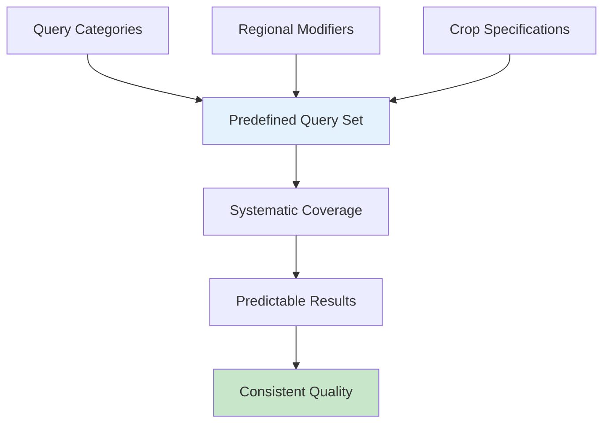
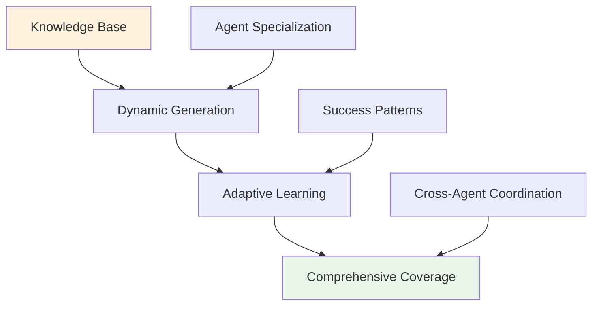
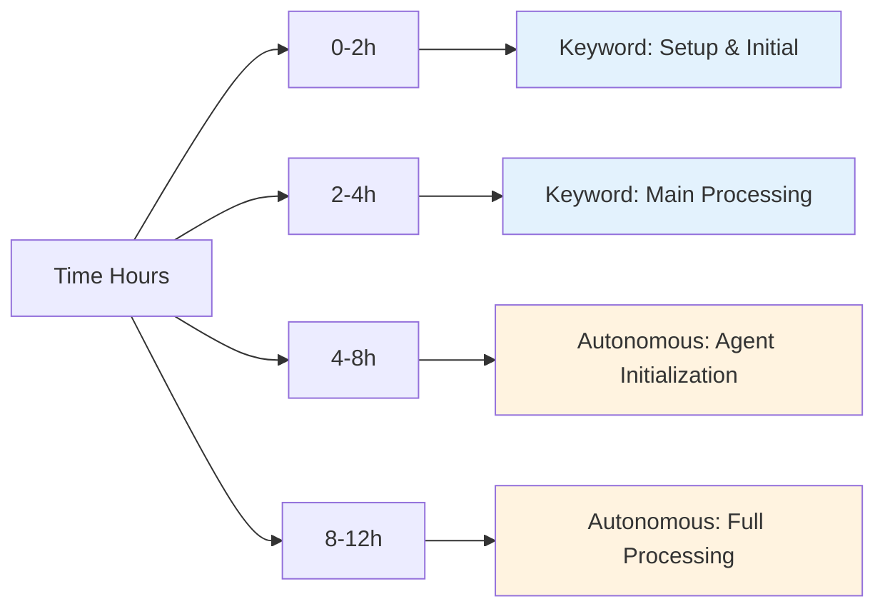
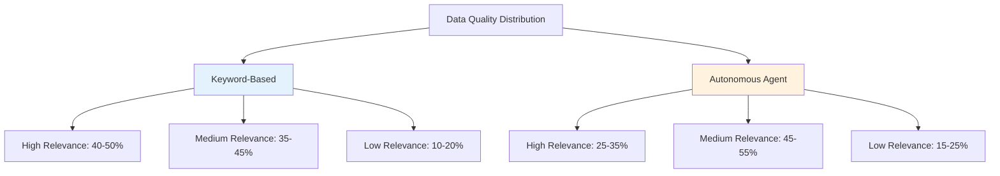
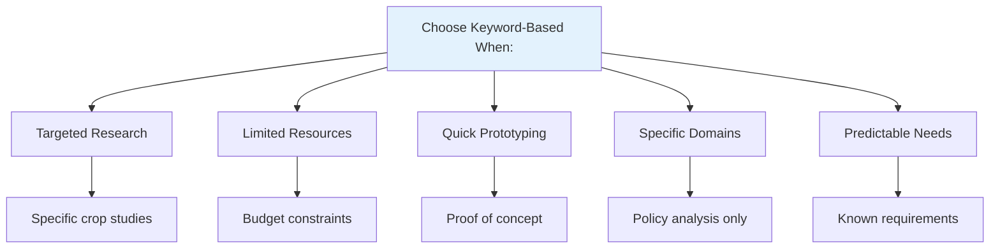
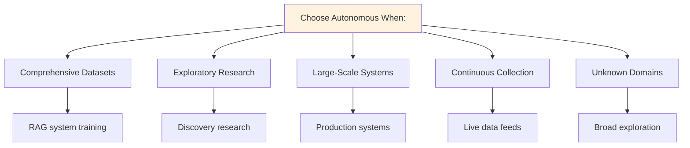
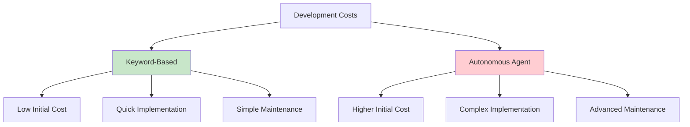
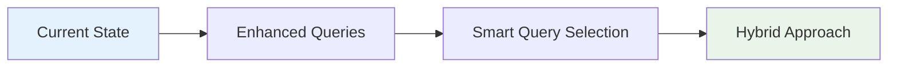
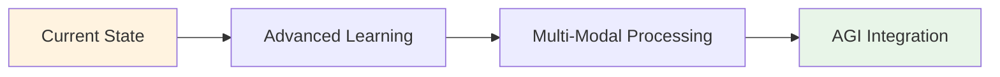
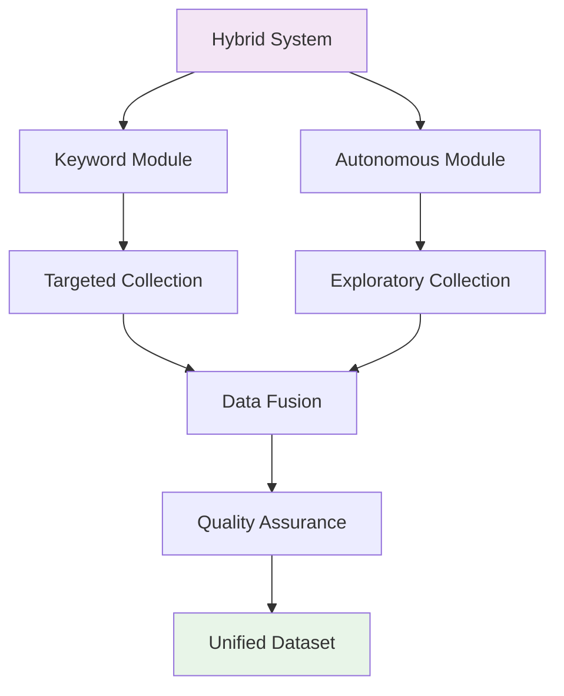

# Approach Comparison Analysis

## 🔍 Overview

This document provides a comprehensive comparison between the two main approaches for creating Indian agriculture datasets: the **Keyword-Based Search Approach** and the **Autonomous Agent Search Approach**. Understanding the strengths, limitations, and optimal use cases for each approach is crucial for selecting the right method for your specific needs.

## 📊 Detailed Comparison Matrix

| Aspect | Keyword-Based Approach | Autonomous Agent Approach |
|--------|------------------------|---------------------------|
| **Search Strategy** | Predefined query patterns | Dynamic query generation |
| **Scalability** | Limited by query database | Unlimited expansion capability |
| **Data Volume** | 500-2,000 entries | 5,000-15,000+ entries |
| **Processing Time** | 2-6 hours | 4-12 hours |
| **Resource Usage** | Moderate (4-8 GB RAM) | Higher (8-16 GB RAM) |
| **Setup Complexity** | Simple configuration | Moderate complexity |
| **Customization** | Query list modification | Agent behavior tuning |
| **Learning Capability** | Static patterns | Adaptive learning |
| **Coverage Predictability** | High predictability | Exploratory coverage |
| **Quality Consistency** | Consistent quality | Variable but improving |
| **Maintenance** | Low maintenance | Moderate maintenance |

## 🎯 Detailed Analysis

### 1. Search Strategy Comparison

#### Keyword-Based Approach


**Characteristics**:
- **Systematic Coverage**: Ensures all predefined categories are covered
- **Predictable Results**: Output quality and volume are predictable
- **Manual Curation**: Queries are manually crafted and tested
- **Domain Expertise**: Leverages human knowledge of agriculture domains

**Example Query Patterns**:
```python
PREDEFINED_QUERIES = [
    "rice cultivation techniques Punjab India",
    "organic farming practices Maharashtra",
    "wheat production statistics India government",
    "sustainable agriculture methods Tamil Nadu"
]
```

#### Autonomous Agent Approach


**Characteristics**:
- **Dynamic Generation**: Creates queries based on knowledge combinations
- **Adaptive Learning**: Improves strategy based on success patterns
- **Comprehensive Exploration**: Discovers unexpected content areas
- **Self-Optimization**: Automatically refines search strategies

**Example Dynamic Generation**:
```python
def generate_autonomous_query(agent):
    crop = random.choice(agent.crops)
    method = random.choice(agent.methods)
    region = random.choice(agent.regions)
    science = random.choice(agent.sciences)
    
    return f"{crop} {method} {science} {region} research"
```

### 2. Performance Characteristics

#### Processing Speed Comparison



**Keyword-Based Performance**:
- **Initialization**: 5-10 minutes
- **Processing Rate**: 100-300 entries/hour
- **Peak Performance**: Consistent throughout
- **Resource Usage**: Stable and predictable

**Autonomous Agent Performance**:
- **Initialization**: 15-30 minutes (agent setup)
- **Processing Rate**: 200-600 entries/hour (after warmup)
- **Peak Performance**: Improves over time with learning
- **Resource Usage**: Variable, increases with agent count

#### Resource Utilization Analysis

| Resource Type | Keyword-Based | Autonomous Agent |
|---------------|---------------|------------------|
| **CPU Usage** | 30-60% | 50-90% |
| **Memory (RAM)** | 4-8 GB | 8-16 GB |
| **Network I/O** | Moderate | High |
| **Storage** | 1-5 GB | 5-20 GB |
| **Concurrent Connections** | 4-20 | 12-50 |

### 3. Data Quality and Coverage

#### Quality Distribution Comparison



#### Coverage Analysis

**Keyword-Based Coverage**:
- **Depth**: Deep coverage of predefined areas
- **Breadth**: Limited to query scope
- **Consistency**: Uniform coverage across categories
- **Gaps**: May miss emerging topics or niche areas

**Autonomous Agent Coverage**:
- **Depth**: Variable depth based on agent learning
- **Breadth**: Comprehensive across all agriculture domains
- **Consistency**: Variable but improving over time
- **Gaps**: Minimal gaps due to exploratory nature

### 4. Use Case Suitability

#### When to Choose Keyword-Based Approach



**Optimal Scenarios**:
1. **Targeted Research Projects**
   - Specific crop or region focus
   - Well-defined research questions
   - Limited scope requirements

2. **Resource-Constrained Environments**
   - Limited computational resources
   - Budget constraints
   - Time-sensitive projects

3. **Proof of Concept Development**
   - Initial RAG system testing
   - Prototype development
   - Feasibility studies

4. **Domain-Specific Applications**
   - Policy analysis focus
   - Economic studies
   - Technology assessment

#### When to Choose Autonomous Agent Approach



**Optimal Scenarios**:
1. **Comprehensive Dataset Creation**
   - Large-scale RAG systems
   - Complete domain coverage
   - High-volume requirements

2. **Exploratory Research**
   - Discovery of new topics
   - Trend identification
   - Comprehensive surveys

3. **Production Systems**
   - Continuous data collection
   - Adaptive requirements
   - Long-term operations

4. **Unknown Domain Exploration**
   - Emerging agriculture topics
   - Cross-domain research
   - Innovation discovery

### 5. Technical Implementation Comparison

#### Architecture Complexity

**Keyword-Based Architecture**:
```python
class KeywordBasedCurator:
    def __init__(self):
        self.queries = load_predefined_queries()
        self.agents = create_agent_pool()
        self.search_engine = WebSearchEngine()
    
    def process(self):
        for query in self.queries:
            agent = self.get_available_agent()
            results = agent.search_and_process(query)
            self.save_results(results)
```

**Autonomous Agent Architecture**:
```python
class AutonomousAgentCurator:
    def __init__(self):
        self.knowledge_base = KnowledgeBase()
        self.agents = [AutonomousAgent(spec) for spec in specializations]
        self.coordinator = AgentCoordinator()
        self.learning_system = AdaptiveLearning()
    
    def process(self):
        while not self.completion_criteria_met():
            for agent in self.agents:
                query = agent.generate_query()
                results = agent.search_and_process(query)
                self.learning_system.update(results)
                self.save_results(results)
```

#### Maintenance Requirements

| Maintenance Aspect | Keyword-Based | Autonomous Agent |
|-------------------|---------------|------------------|
| **Query Updates** | Manual addition/modification | Automatic adaptation |
| **Performance Tuning** | Configuration adjustments | Learning parameter tuning |
| **Error Handling** | Simple retry logic | Complex adaptive strategies |
| **Monitoring** | Basic progress tracking | Comprehensive agent monitoring |
| **Debugging** | Straightforward query tracing | Complex agent behavior analysis |

### 6. Cost-Benefit Analysis

#### Development Costs



#### Operational Costs

| Cost Factor | Keyword-Based | Autonomous Agent |
|-------------|---------------|------------------|
| **Compute Resources** | $50-200/month | $200-800/month |
| **Storage** | $10-50/month | $50-200/month |
| **Maintenance Time** | 2-5 hours/month | 10-20 hours/month |
| **Updates & Improvements** | 5-10 hours/month | 20-40 hours/month |

#### Return on Investment

**Keyword-Based ROI**:
- **Quick Results**: Immediate value from targeted data
- **Predictable Outcomes**: Known quality and quantity
- **Lower Risk**: Proven methodology
- **Faster Time-to-Market**: Quick deployment

**Autonomous Agent ROI**:
- **Comprehensive Coverage**: Higher long-term value
- **Adaptive Improvement**: Increasing quality over time
- **Scalable Growth**: Unlimited expansion potential
- **Innovation Discovery**: Unexpected valuable findings

### 7. Risk Assessment

#### Keyword-Based Risks

| Risk Level | Risk Factor | Mitigation Strategy |
|------------|-------------|-------------------|
| **Low** | Query coverage gaps | Regular query set reviews |
| **Low** | Predictable limitations | Scope management |
| **Medium** | Static approach obsolescence | Periodic methodology updates |

#### Autonomous Agent Risks

| Risk Level | Risk Factor | Mitigation Strategy |
|------------|-------------|-------------------|
| **Medium** | Unpredictable resource usage | Resource monitoring and limits |
| **Medium** | Complex debugging | Comprehensive logging |
| **High** | Agent behavior drift | Regular performance validation |
| **High** | Quality inconsistency | Multi-level quality assurance |

### 8. Future Evolution Potential

#### Keyword-Based Evolution Path



**Evolution Opportunities**:
- Enhanced query generation algorithms
- Machine learning for query optimization
- Integration with autonomous features
- Domain-specific specialization

#### Autonomous Agent Evolution Path



**Evolution Opportunities**:
- Advanced machine learning integration
- Multi-modal content processing (images, videos)
- Natural language query generation
- Cross-domain knowledge transfer

## 🎯 Decision Framework

### Selection Criteria Matrix

Use this matrix to score your requirements (1-5 scale) and calculate the best approach:

| Criteria | Weight | Keyword Score | Autonomous Score |
|----------|--------|---------------|------------------|
| **Budget Constraints** | 0.2 | 4 | 2 |
| **Time to Deployment** | 0.15 | 5 | 2 |
| **Data Volume Needs** | 0.2 | 2 | 5 |
| **Coverage Breadth** | 0.15 | 2 | 5 |
| **Quality Consistency** | 0.1 | 4 | 3 |
| **Maintenance Capacity** | 0.1 | 4 | 2 |
| **Innovation Requirements** | 0.1 | 2 | 5 |

**Calculation Example**:
- Keyword Total: (4×0.2) + (5×0.15) + (2×0.2) + (2×0.15) + (4×0.1) + (4×0.1) + (2×0.1) = 3.05
- Autonomous Total: (2×0.2) + (2×0.15) + (5×0.2) + (5×0.15) + (3×0.1) + (2×0.1) + (5×0.1) = 3.55

### Recommendation Algorithm

```python
def recommend_approach(requirements):
    scores = {
        'keyword': 0,
        'autonomous': 0
    }
    
    # Budget-sensitive projects
    if requirements['budget'] < 5000:
        scores['keyword'] += 2
    
    # Time-sensitive projects
    if requirements['timeline'] < 30:  # days
        scores['keyword'] += 2
    
    # Large-scale data needs
    if requirements['data_volume'] > 5000:
        scores['autonomous'] += 2
    
    # Exploratory research
    if requirements['research_type'] == 'exploratory':
        scores['autonomous'] += 2
    
    # Resource availability
    if requirements['compute_resources'] > 16:  # GB RAM
        scores['autonomous'] += 1
    
    return max(scores, key=scores.get)
```

## 📈 Hybrid Approach Considerations

### Combining Both Approaches

For maximum effectiveness, consider a hybrid strategy:

1. **Phase 1**: Use keyword-based approach for initial dataset creation
2. **Phase 2**: Deploy autonomous agents for expansion and discovery
3. **Phase 3**: Continuous operation with both approaches for different purposes

### Hybrid Architecture



This comprehensive comparison provides the foundation for making informed decisions about which approach best fits your specific Indian agriculture data collection needs.