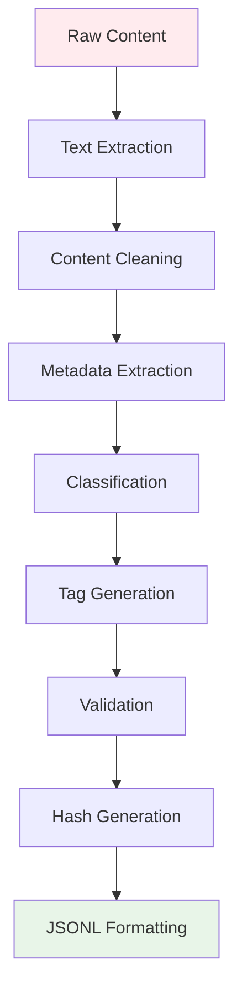

# Data Format Specification

## 📋 Overview

This document provides a comprehensive specification of the data format used by both the keyword-based and autonomous agent search approaches. The output format is designed to be optimal for Retrieval-Augmented Generation (RAG) systems while maintaining rich metadata for filtering and analysis.

## 🗂️ JSONL Format Structure

Each line in the output JSONL file represents a single agriculture data entry with the following structure:

```json
{
  "title": "string",
  "author": "string|null",
  "link": "string",
  "text_extracted": "string",
  "abstract": "string",
  "genre": "string",
  "tags": ["string"],
  "indian_regions": ["string"],
  "crop_types": ["string"],
  "farming_methods": ["string"],
  "soil_types": ["string"],
  "climate_info": ["string"],
  "fertilizers": ["string"],
  "watering_schedule": "string|null",
  "plant_species": ["string"],
  "data_type": "string",
  "publication_year": "integer|null",
  "source_domain": "string",
  "extraction_timestamp": "string",
  "relevance_score": "float",
  "content_length": "integer",
  "content_hash": "string",
  "url_hash": "string",
  "is_pdf": "boolean",
  "pdf_path": "string|null"
}
```

## 📝 Field Specifications

### Core Content Fields

#### `title` (string, required)
- **Description**: The title or headline of the content
- **Source**: Extracted from HTML `<title>` tags, PDF metadata, or article headers
- **Processing**: Cleaned of extra whitespace and HTML entities
- **Example**: `"Smart farming: Leveraging IoT and deep learning for tomato cultivation"`

#### `author` (string|null, optional)
- **Description**: Author(s) of the content if available
- **Source**: Extracted from metadata, bylines, or citation information
- **Format**: Multiple authors separated by commas
- **Example**: `"Dr. Singh, R.K., Prof. Sharma, M."`
- **Null case**: When author information is not available

#### `link` (string, required)
- **Description**: Original URL of the content source
- **Format**: Full HTTP/HTTPS URL
- **Validation**: Must be a valid URL format
- **Example**: `"https://www.sciencedirect.com/science/article/pii/S2772899424000284"`

#### `text_extracted` (string, required)
- **Description**: Full extracted text content from the source
- **Processing**: 
  - HTML tags removed
  - Special characters normalized
  - Excessive whitespace cleaned
  - OCR text included for PDFs when available
- **Length**: Variable, typically 100-50,000 characters
- **Example**: `"The proposed system suggests an IoT based tomato cultivation and pest management system..."`

#### `abstract` (string, required)
- **Description**: Brief summary or abstract of the content
- **Generation**: 
  - Extracted from existing abstracts when available
  - Generated from first few sentences if no abstract exists
  - Truncated to reasonable length (typically 200-500 characters)
- **Example**: `"This study presents an IoT-based system for tomato cultivation with integrated pest management using machine learning techniques."`

### Classification Fields

#### `genre` (string, required)
- **Description**: Content type classification
- **Allowed Values**:
  - `"survey"` - Research surveys and comprehensive studies
  - `"dataset"` - Statistical datasets and data collections
  - `"pdf"` - PDF documents and reports
  - `"book"` - Books and book chapters
  - `"report"` - Government and institutional reports
  - `"article"` - Journal articles and research papers
  - `"news"` - News articles and press releases
  - `"thesis"` - Academic theses and dissertations
  - `"manual"` - Technical manuals and guides
  - `"policy"` - Policy documents and regulations
- **Classification Logic**: Based on URL patterns, content structure, and keyword analysis
- **Example**: `"article"`

#### `data_type` (string, required)
- **Description**: Type of data content classification
- **Allowed Values**:
  - `"statistical"` - Numerical data, statistics, quantitative analysis
  - `"qualitative"` - Descriptive content, case studies, observations
  - `"mixed"` - Combination of statistical and qualitative content
  - `"technical"` - Technical specifications, procedures, methods
  - `"policy"` - Policy analysis, regulations, guidelines
- **Example**: `"mixed"`

### Agriculture-Specific Fields

#### `tags` (array of strings, required)
- **Description**: Relevant keywords and tags extracted from content
- **Generation**: 
  - Automatic extraction based on agriculture keyword dictionary
  - Content analysis for relevant terms
  - Manual curation for high-priority content
- **Typical Count**: 3-15 tags per entry
- **Example**: `["pest", "article", "technology", "IoT", "tomato"]`

#### `indian_regions` (array of strings, required)
- **Description**: Indian states, regions, or geographical areas mentioned
- **Recognition**: Pattern matching against comprehensive Indian geography database
- **Format**: Standard state/region names
- **Example**: `["Punjab", "Maharashtra", "Tamil Nadu"]`
- **Empty Array**: When no specific Indian regions are identified

#### `crop_types` (array of strings, required)
- **Description**: Agricultural crops mentioned in the content
- **Recognition**: Pattern matching against comprehensive crop database
- **Categories**: Cereals, pulses, cash crops, oilseeds, spices, fruits, vegetables
- **Example**: `["rice", "wheat", "tomato"]`
- **Empty Array**: When no specific crops are identified

#### `farming_methods` (array of strings, required)
- **Description**: Farming techniques and methods mentioned
- **Categories**:
  - `"organic farming"` - Organic and natural farming practices
  - `"precision agriculture"` - Technology-driven farming
  - `"sustainable farming"` - Environmentally sustainable practices
  - `"traditional farming"` - Conventional farming methods
  - `"hydroponic"` - Soilless cultivation
  - `"greenhouse"` - Protected cultivation
  - `"drip irrigation"` - Water-efficient irrigation
  - `"crop rotation"` - Rotational farming practices
- **Example**: `["organic farming", "drip irrigation"]`

#### `soil_types` (array of strings, required)
- **Description**: Soil types and classifications mentioned
- **Categories**:
  - `"alluvial"` - Alluvial soils
  - `"black"` - Black cotton soils
  - `"red"` - Red soils
  - `"laterite"` - Laterite soils
  - `"sandy"` - Sandy soils
  - `"clay"` - Clay soils
  - `"loamy"` - Loamy soils
- **Example**: `["black", "alluvial"]`

#### `climate_info` (array of strings, required)
- **Description**: Climate-related information and conditions
- **Categories**:
  - `"tropical"` - Tropical climate conditions
  - `"temperate"` - Temperate climate
  - `"arid"` - Arid and semi-arid conditions
  - `"monsoon"` - Monsoon-related information
  - `"drought"` - Drought conditions and management
  - `"flood"` - Flood-related information
  - `"seasonal"` - Seasonal climate patterns
- **Example**: `["tropical", "monsoon"]`

#### `fertilizers` (array of strings, required)
- **Description**: Fertilizers and nutrients mentioned
- **Categories**:
  - `"organic"` - Organic fertilizers and compost
  - `"NPK"` - Nitrogen, Phosphorus, Potassium fertilizers
  - `"urea"` - Urea-based fertilizers
  - `"phosphate"` - Phosphate fertilizers
  - `"potash"` - Potash fertilizers
  - `"micronutrients"` - Trace elements and micronutrients
  - `"biofertilizers"` - Biological fertilizers
- **Example**: `["organic", "NPK"]`

#### `watering_schedule` (string|null, optional)
- **Description**: Specific watering or irrigation schedules mentioned
- **Format**: Free text description of watering patterns
- **Example**: `"Daily morning irrigation during flowering stage"`
- **Null case**: When no specific schedule is mentioned

#### `plant_species` (array of strings, required)
- **Description**: Specific plant species or varieties mentioned
- **Format**: Scientific names or common variety names
- **Example**: `["Oryza sativa", "Basmati rice", "BT Cotton"]`
- **Empty Array**: When no specific species are identified

### Metadata Fields

#### `publication_year` (integer|null, optional)
- **Description**: Year of publication if available
- **Range**: Typically 1990-2025
- **Extraction**: From metadata, URLs, or content analysis
- **Example**: `2023`
- **Null case**: When publication year cannot be determined

#### `source_domain` (string, required)
- **Description**: Domain name of the source website
- **Format**: Domain without protocol (e.g., "example.com")
- **Example**: `"www.sciencedirect.com"`
- **Usage**: For source credibility assessment and filtering

#### `extraction_timestamp` (string, required)
- **Description**: ISO 8601 timestamp of when the data was extracted
- **Format**: `"YYYY-MM-DDTHH:MM:SS.ssssss"`
- **Timezone**: UTC
- **Example**: `"2025-08-09T08:03:02.134635"`

#### `relevance_score` (float, required)
- **Description**: Calculated relevance score for agriculture content
- **Range**: 0.0 to 1.0
- **Calculation**: Based on keyword matching, domain authority, and content quality
- **Example**: `0.85`
- **Interpretation**: Higher scores indicate more relevant agriculture content

#### `content_length` (integer, required)
- **Description**: Character count of extracted text
- **Range**: Typically 100-50,000 characters
- **Usage**: For content quality assessment and filtering
- **Example**: `3245`

#### `content_hash` (string, required)
- **Description**: MD5 hash of the extracted content for deduplication
- **Format**: 32-character hexadecimal string
- **Purpose**: Identify duplicate content across different URLs
- **Example**: `"f7dac7aed29db96f30a630e9f10afaa4"`

#### `url_hash` (string, required)
- **Description**: MD5 hash of the source URL for deduplication
- **Format**: 32-character hexadecimal string
- **Purpose**: Identify duplicate URLs and prevent reprocessing
- **Example**: `"69072cdc5685ca62f7a38ae6e13ac348"`

#### `is_pdf` (boolean, required)
- **Description**: Indicates if the source was a PDF document
- **Values**: `true` or `false`
- **Usage**: For processing pipeline decisions and filtering
- **Example**: `false`

#### `pdf_path` (string|null, optional)
- **Description**: Local file path if PDF was downloaded
- **Format**: Relative path from output directory
- **Example**: `"downloaded_pdfs/agriculture_report_2023.pdf"`
- **Null case**: When source is not a PDF or PDF was not downloaded

## 📊 Data Quality Indicators

### Quality Metrics

#### Relevance Score Interpretation
- **0.8-1.0**: Highly relevant agriculture content with strong Indian context
- **0.6-0.8**: Good agriculture content with moderate relevance
- **0.4-0.6**: Moderately relevant content with some agriculture aspects
- **0.2-0.4**: Low relevance with minimal agriculture content
- **0.0-0.2**: Very low relevance, possibly off-topic

#### Content Length Guidelines
- **< 100 characters**: Very short, possibly incomplete extraction
- **100-500 characters**: Short content, abstracts, or summaries
- **500-2000 characters**: Medium-length articles or sections
- **2000-10000 characters**: Full articles or comprehensive content
- **> 10000 characters**: Long-form content, reports, or documents

### Data Validation Rules

#### Required Field Validation
```python
def validate_entry(entry):
    required_fields = [
        'title', 'link', 'text_extracted', 'abstract', 'genre',
        'tags', 'indian_regions', 'crop_types', 'farming_methods',
        'soil_types', 'climate_info', 'fertilizers', 'plant_species',
        'data_type', 'source_domain', 'extraction_timestamp',
        'relevance_score', 'content_length', 'content_hash',
        'url_hash', 'is_pdf'
    ]
    
    for field in required_fields:
        if field not in entry:
            return False, f"Missing required field: {field}"
    
    return True, "Valid entry"
```

#### Data Type Validation
```python
def validate_data_types(entry):
    validations = [
        ('title', str),
        ('link', str),
        ('text_extracted', str),
        ('relevance_score', (int, float)),
        ('content_length', int),
        ('is_pdf', bool),
        ('tags', list),
        ('indian_regions', list),
        ('crop_types', list)
    ]
    
    for field, expected_type in validations:
        if not isinstance(entry[field], expected_type):
            return False, f"Invalid type for {field}"
    
    return True, "Valid types"
```

## 🔄 Data Processing Pipeline

### Extraction Process



### Quality Assurance Steps

1. **Content Validation**: Ensure minimum content length and quality
2. **Relevance Scoring**: Calculate agriculture relevance score
3. **Duplicate Detection**: Check content and URL hashes
4. **Format Validation**: Verify JSONL structure and data types
5. **Metadata Enrichment**: Add classification and tags
6. **Final Review**: Quality threshold filtering

## 📈 Usage Examples

### RAG System Integration

```python
import json

def load_agriculture_data(jsonl_file, min_relevance=0.3):
    """Load agriculture data for RAG system"""
    entries = []
    
    with open(jsonl_file, 'r', encoding='utf-8') as f:
        for line in f:
            if line.strip():
                entry = json.loads(line)
                if entry['relevance_score'] >= min_relevance:
                    entries.append({
                        'text': entry['text_extracted'],
                        'metadata': {
                            'title': entry['title'],
                            'source': entry['link'],
                            'crops': entry['crop_types'],
                            'regions': entry['indian_regions'],
                            'relevance': entry['relevance_score']
                        }
                    })
    
    return entries
```

### Data Analysis Example

```python
def analyze_dataset(jsonl_file):
    """Analyze dataset characteristics"""
    stats = {
        'total_entries': 0,
        'avg_relevance': 0,
        'crop_distribution': {},
        'region_distribution': {},
        'genre_distribution': {},
        'source_domains': set()
    }
    
    with open(jsonl_file, 'r', encoding='utf-8') as f:
        for line in f:
            if line.strip():
                entry = json.loads(line)
                stats['total_entries'] += 1
                stats['avg_relevance'] += entry['relevance_score']
                stats['source_domains'].add(entry['source_domain'])
                
                # Count crops
                for crop in entry['crop_types']:
                    stats['crop_distribution'][crop] = stats['crop_distribution'].get(crop, 0) + 1
                
                # Count regions
                for region in entry['indian_regions']:
                    stats['region_distribution'][region] = stats['region_distribution'].get(region, 0) + 1
                
                # Count genres
                genre = entry['genre']
                stats['genre_distribution'][genre] = stats['genre_distribution'].get(genre, 0) + 1
    
    stats['avg_relevance'] /= stats['total_entries']
    return stats
```

This data format specification ensures consistent, high-quality datasets suitable for RAG systems while maintaining rich metadata for analysis and filtering.