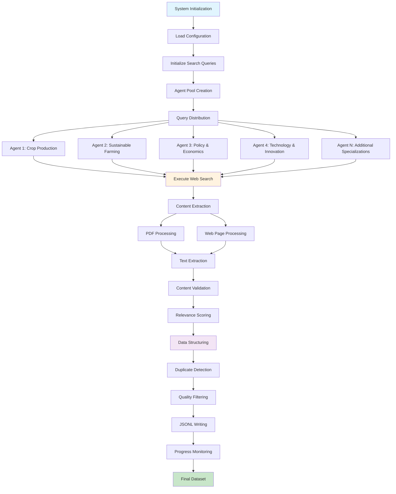
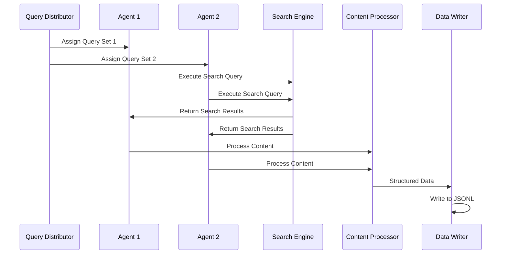
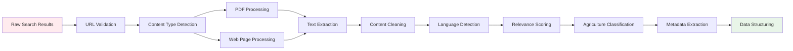

# Keyword-Based Search Approach - Detailed Workflow

## 🎯 Overview

The keyword-based search approach uses a systematic methodology with predefined search queries to collect Indian agriculture data. This approach ensures comprehensive coverage of known agriculture domains through structured search patterns.

## 🔄 Detailed Workflow Diagram



## 📋 Component Details

### 1. System Initialization Phase

**Purpose**: Set up the environment and load configurations

**Components**:
- Configuration loader (`config.yaml`)
- Search query definitions
- Agent pool initialization
- Output file setup

**Key Files**:
- `agriculture_data_curator.py` - Main orchestrator
- `config.yaml` - System configuration
- `search_queries.py` - Predefined query sets

### 2. Query Distribution System

**Search Query Categories**:

```
Agriculture Domains:
├── Crops (15 categories)
│   ├── Cereals: rice, wheat, maize, barley, millets
│   ├── Pulses: lentils, chickpeas, pigeon peas
│   ├── Cash Crops: cotton, sugarcane, tobacco
│   ├── Oilseeds: groundnut, mustard, sesame
│   └── Spices: turmeric, coriander, cumin
├── Regions (28 Indian States)
│   ├── Major Agricultural States
│   ├── Agro-climatic Zones
│   └── Regional Specializations
├── Methods (12 categories)
│   ├── Traditional Practices
│   ├── Modern Techniques
│   └── Sustainable Approaches
└── Economics (8 categories)
    ├── Policy Analysis
    ├── Market Dynamics
    └── Financial Schemes
```

### 3. Agent Specialization Matrix

| Agent ID | Specialization | Query Modification | Expected Output |
|----------|----------------|-------------------|-----------------|
| 0 | Crop Production & Statistics | Adds production data keywords | Statistical reports, yield data |
| 1 | Sustainable Farming Practices | Focuses on organic, eco-friendly | Sustainability studies, organic farming |
| 2 | Agricultural Policy & Economics | Emphasizes policy, economics | Government reports, economic analysis |
| 3 | Technology & Innovation | Highlights tech, precision farming | Research papers, tech implementations |
| N | Custom Specializations | User-defined modifications | Domain-specific content |

### 4. Search Execution Flow



### 5. Content Processing Pipeline



### 6. Quality Assurance System

**Relevance Scoring Algorithm**:
```python
def calculate_relevance_score(content, title, domain):
    score = 0.0
    
    # Agriculture keyword matching (40%)
    agriculture_keywords = ["agriculture", "farming", "crop", "soil", "irrigation"]
    keyword_score = count_keywords(content, agriculture_keywords) * 0.4
    
    # Indian context relevance (30%)
    indian_keywords = ["India", "Indian", state_names, crop_varieties]
    indian_score = count_keywords(content, indian_keywords) * 0.3
    
    # Domain authority (20%)
    domain_score = get_domain_priority(domain) * 0.2
    
    # Content quality (10%)
    quality_score = assess_content_quality(content) * 0.1
    
    return min(1.0, keyword_score + indian_score + domain_score + quality_score)
```

**Quality Filters**:
- Minimum content length: 100 characters
- Relevance threshold: 0.05 (configurable)
- Language preference: English, Hindi
- Domain prioritization: Government, research institutions

### 7. Data Structure Specification

**Output Schema**:
```json
{
  "title": "string - Content title",
  "author": "string|null - Author information",
  "link": "string - Source URL",
  "text_extracted": "string - Full content text",
  "abstract": "string - Generated summary",
  "genre": "enum - Content type classification",
  "tags": "array - Relevant keywords",
  "indian_regions": "array - Identified Indian regions",
  "crop_types": "array - Identified crops",
  "farming_methods": "array - Identified methods",
  "soil_types": "array - Soil classifications",
  "climate_info": "array - Climate data",
  "fertilizers": "array - Fertilizer information",
  "data_type": "enum - Data classification",
  "publication_year": "integer|null - Publication year",
  "source_domain": "string - Source domain",
  "extraction_timestamp": "string - ISO timestamp",
  "relevance_score": "float - Calculated relevance",
  "content_length": "integer - Character count",
  "content_hash": "string - Content hash for deduplication",
  "url_hash": "string - URL hash",
  "is_pdf": "boolean - PDF source indicator",
  "pdf_path": "string|null - Local PDF path"
}
```

## 🎯 Search Strategy Details

### Base Query Patterns

1. **Crop-Specific Searches**:
   ```
   "{crop} cultivation India research"
   "{crop} production statistics {state}"
   "{crop} farming practices {region}"
   "sustainable {crop} agriculture India"
   ```

2. **Regional Searches**:
   ```
   "agriculture {state} government reports"
   "{region} farming survey data"
   "agricultural policy {state} implementation"
   ```

3. **Method-Focused Searches**:
   ```
   "organic farming India certification"
   "precision agriculture technology India"
   "irrigation management {crop} India"
   ```

4. **Economic Searches**:
   ```
   "agricultural subsidies India farmers"
   "crop insurance schemes implementation"
   "agricultural market prices India"
   ```

### Query Modification Strategies

**Agent-Specific Modifications**:
- **Agent 0 (Production)**: Adds "production", "yield", "statistics", "data"
- **Agent 1 (Sustainability)**: Adds "sustainable", "organic", "eco-friendly", "conservation"
- **Agent 2 (Policy)**: Adds "policy", "government", "scheme", "subsidy"
- **Agent 3 (Technology)**: Adds "technology", "innovation", "precision", "IoT"

**Regional Modifications**:
- Adds state names and regional identifiers
- Includes agro-climatic zone specifications
- Incorporates local crop varieties and practices

## 📊 Performance Characteristics

### Expected Metrics

| Metric | Typical Range | Optimal Target |
|--------|---------------|----------------|
| **Processing Speed** | 50-200 entries/hour | 150+ entries/hour |
| **Success Rate** | 70-85% | 80%+ |
| **Relevance Score** | 0.3-0.9 average | 0.6+ average |
| **Duplicate Rate** | 5-15% | <10% |
| **Content Coverage** | 60+ domains | 100+ domains |

### Resource Requirements

**Computational**:
- CPU: 4+ cores recommended
- RAM: 8GB+ for optimal performance
- Storage: 10GB+ for PDF downloads
- Network: Stable internet connection

**Time Estimates**:
- Small dataset (500 entries): 2-4 hours
- Medium dataset (1000 entries): 4-8 hours
- Large dataset (2000+ entries): 8-16 hours

## 🔧 Configuration Options

### Key Configuration Parameters

```yaml
curator:
  num_agents: 4-20              # Parallel processing agents
  max_search_results: 15-40     # Results per query
  max_queries: null|number      # Query limit for testing
  min_relevance_score: 0.05     # Quality threshold
  search_timeout: 15            # Request timeout
  query_delay: 1.1              # Rate limiting delay

search_categories:
  crops: [list]                 # Crop categories
  regions: [list]               # Indian regions
  methods: [list]               # Farming methods
  economics: [list]             # Economic aspects

priority_domains:
  - "icar.org.in"              # Research institutions
  - "agricoop.nic.in"          # Government sources
  - "researchgate.net"         # Academic papers
```

## 🚀 Optimization Strategies

### Performance Optimization

1. **Parallel Processing**:
   - Optimal agent count: 4-8 for most systems
   - Thread pool management for concurrent requests
   - Memory-efficient content processing

2. **Caching Strategy**:
   - URL deduplication cache
   - Content hash verification
   - Search result caching

3. **Rate Limiting**:
   - Respectful crawling delays
   - Domain-specific rate limits
   - Error handling and retry logic

### Quality Optimization

1. **Enhanced Filtering**:
   - Multi-level relevance scoring
   - Content quality assessment
   - Source credibility weighting

2. **Data Enrichment**:
   - Automatic tagging and classification
   - Metadata extraction and validation
   - Cross-reference verification

## 🎯 Use Case Scenarios

### Scenario 1: Targeted Research Dataset
**Goal**: Create dataset for specific crop research
**Configuration**: 
- Focus on 2-3 crop types
- High relevance threshold (0.7+)
- Academic source prioritization
- 4 agents, 500-1000 entries

### Scenario 2: Comprehensive Policy Analysis
**Goal**: Gather policy and economic data
**Configuration**:
- Policy-focused search queries
- Government domain prioritization
- Economic keyword emphasis
- 6 agents, 1000-2000 entries

### Scenario 3: Technology Innovation Survey
**Goal**: Collect modern farming technology data
**Configuration**:
- Technology-specific queries
- Research paper prioritization
- Innovation keyword focus
- 8 agents, 1500+ entries

This keyword-based approach provides systematic, reliable data collection with predictable coverage and quality characteristics, making it ideal for targeted research and specific domain exploration.